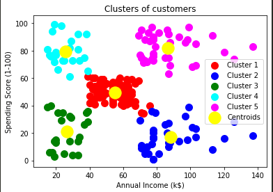

# K-means-Mall-customer-clustering

This model is to target customers, so customers which are more similar are divided into same cluster and given the label of which cluster they belong to.

The independent variables are Annual Income and Spending score, and then data points are assigned  clusters using k-means algorithm

## Customers

  
## Cluster of customers

